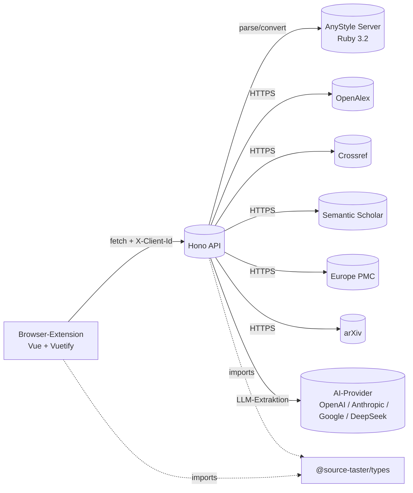
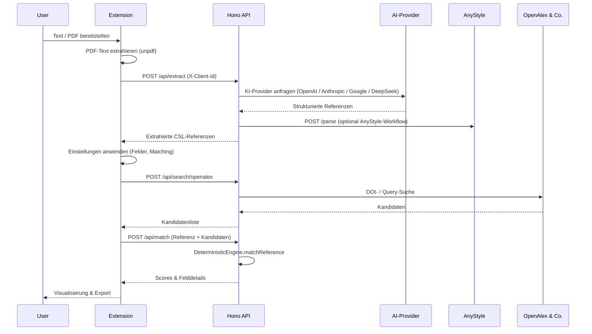

# Architektur

## Komponenten

- **Browser-Extension** (Vue 3, Pinia, Vuetify): UI-Schicht, verwaltet WebExtension-Storage (`clientId`, Einstellungen) und kommuniziert per `fetch` mit der API.
- **Source Taster API** (Hono): Stellt `/api/extract`, `/api/search/:database`, `/api/match`, `/api/anystyle/*`, `/api/user/*` bereit.
- **AnyStyle-Server** (Ruby, Sinatra): Tokenisiert Referenzen und konvertiert sie in CSL.
- **Externe Datenquellen**: OpenAlex, Crossref, Semantic Scholar, Europe PMC, arXiv.
- **Shared Types** (`@source-taster/types`): CSL-JSON-Schemata, API-Verträge, Matching-Konfigurationen.

## Sequenz: „Extrahieren & Verifizieren“

## Schichten & Verantwortlichkeiten

| Schicht        | Verantwortung                                                                                                                                             |
| -------------- | --------------------------------------------------------------------------------------------------------------------------------------------------------- |
| Extension UI   | UX, lokales Speichermanagement und Orchestrierung von Extraktion → Suche → Matching.                                                                      |
| API-Controller | Zod-Parsing, Header-Validierung (`X-Client-Id`), Fehlerbehandlung via `registerOnError`.                                                                  |
| Services       | Extraction (`ReferenceExtractionCoordinator`), Search (`SearchCoordinator` + Provider), Matching (`DeterministicEngine`), Secrets (`UserSecretsService`). |
| Provider       | Je Datenquelle eine Klasse mit DOI-/Identifier-Shortcuts und Query-Heuristiken.                                                                           |
| Utils          | Normalisierung, Ähnlichkeitsfunktionen, dynamische Zod-Schemata für LLM-Antworten.                                                                        |

## Datenflüsse & Speicherung

- Die **clientId** wird einmalig per `useWebExtensionStorage` erzeugt und bei `/api/extract` sowie `/api/user/*` gesendet.
- **Nutzer-API-Keys** werden AES-256-GCM-verschlüsselt in `.keystore/` abgelegt (konfigurierbar).
- **Matching-Ergebnisse** werden serverseitig nicht persistiert; der Browser hält den Zustand.
- **AnyStyle** läuft als separater Service (Docker-Compose-Service `anystyle`).

## Fehler- & Logging-Konzept

- `registerOnError` mappt `ZodError` auf `validation_error`, `HTTPException` auf passende Codes (z. B. `unauthorized`).
- Provider loggen Warnungen bei niedrigen Rate-Limits (`OpenAlexProvider.checkRateLimit`, `CrossrefProvider`, …).
- Im DEV-Modus erlaubt `corsMiddleware` alle Origins; in PROD sind `ALLOWED_EXTENSION_IDS` erforderlich.

Weitere Details findest du in der [API-Referenz](api.md) sowie bei den [Matching- und Scoring-Regeln](matching-scoring.md).
