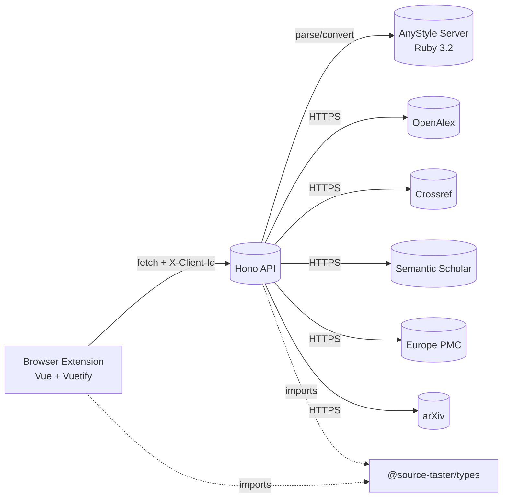
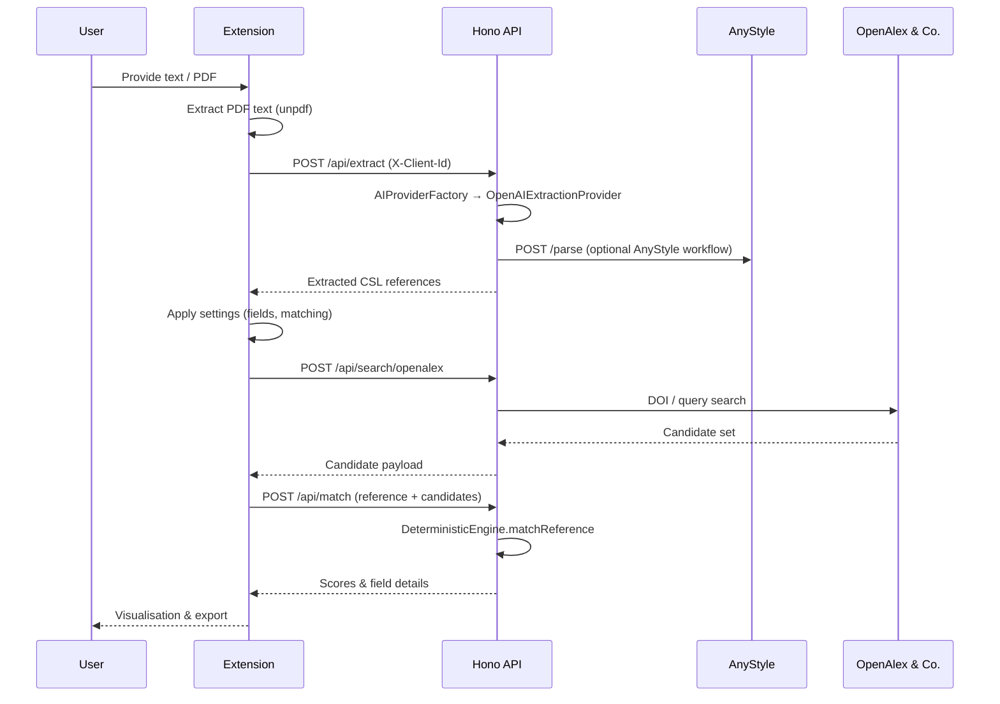

# Architecture

## Components

- **Browser extension** (Vue 3, Pinia, Vuetify): UI layer, manages WebExtension storage (`clientId`, settings), and communicates with the API via `fetch`.
- **Source Taster API** (Hono): exposes `/api/extract`, `/api/search/:database`, `/api/match`, `/api/anystyle/*`, `/api/user/*`.
- **AnyStyle server** (Ruby, Sinatra): tokenises references and converts them to CSL.
- **External data sources**: OpenAlex, Crossref, Semantic Scholar, Europe PMC, arXiv.
- **Shared types** (`@source-taster/types`): CSL-JSON schemas, API contracts, matching configuration.

## Sequence: “Extract & Verify”

## Layers & Responsibilities

| Layer           | Responsibility                                                                                                                                                 |
| --------------- | -------------------------------------------------------------------------------------------------------------------------------------------------------------- |
| Extension UI    | UX, local storage management, and orchestration of extraction → search → matching.                                                                             |
| API controllers | Parse requests with Zod, validate headers (`X-Client-Id`), map errors through `registerOnError`.                                                               |
| Services        | Extraction (`ReferenceExtractionCoordinator`), search (`SearchCoordinator` + providers), matching (`DeterministicEngine`), and secrets (`UserSecretsService`). |
| Providers       | One class per external data source with DOI/identifier shortcuts and query heuristics.                                                                         |
| Utilities       | Normalisation helpers, similarity functions, dynamic Zod schemas for LLM responses.                                                                            |

## Data Flow & Storage

- The **clientId** is generated once via `useWebExtensionStorage` and sent alongside `/api/extract` and `/api/user/*` calls.
- **User API keys** are encrypted (AES-256-GCM) and stored in `.keystore/` (configurable via environment variables).
- **Matching results** are not persisted server-side; the browser keeps the state.
- **AnyStyle** runs as a dedicated service (see Docker Compose `anystyle` service).

## Error Handling & Logging

- `registerOnError` maps `ZodError` to `validation_error`, `HTTPException` to descriptive codes (for example `unauthorized`).
- Providers log warnings when rate limits are near the threshold (`OpenAlexProvider.checkRateLimit`, `CrossrefProvider`, etc.).
- In development the `corsMiddleware` allows all origins; production requires explicit `ALLOWED_EXTENSION_IDS`.

For API-level details see [API Reference](api.md), and for scoring heuristics see [Matching & Scoring](matching-scoring.md).
